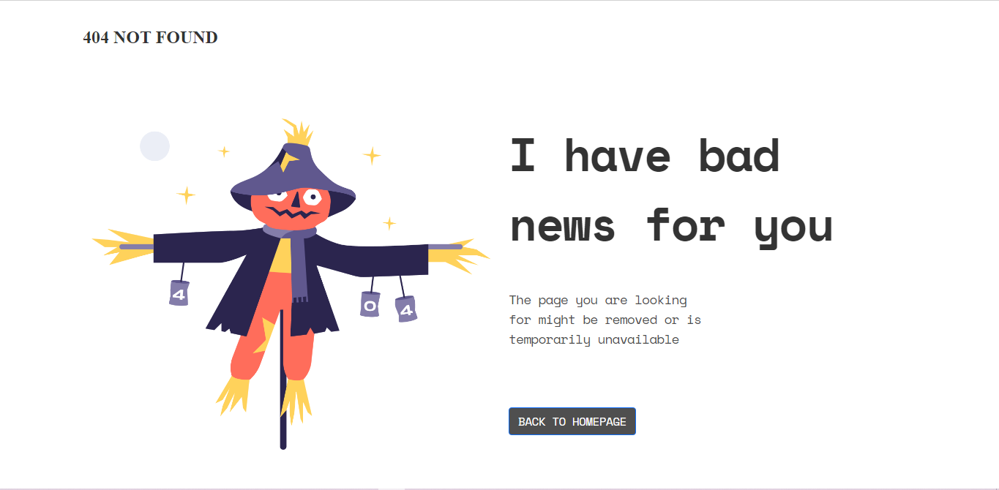
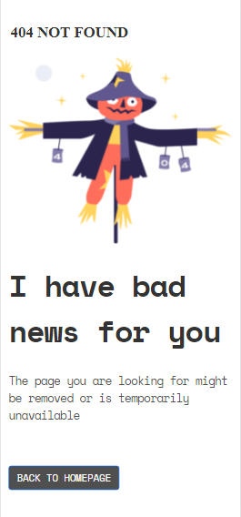

<!-- Please update value in the {Devchallenges.io 404 Page}  -->

<h1 align="center">404 Page</h1>

   Solution for a challenge from  <a href="http://devchallenges.io" target="_blank">Devchallenges.io</a>.

  <h3>
    <a href="https://{your-demo-link.your-domain}">
      Demo
    </a>
     | 
    <a href="https://{your-url-to-the-solution}">
      Solution
    </a>
     | 
    <a href="https://devchallenges.io/challenges/wBunSb7FPrIepJZAg0sY">
      Challenge
    </a>
  </h3>

<!-- TABLE OF CONTENTS -->

## Table of Contents

- [Desktop Overview](#overview)
- [Mobile Overview](#mobile-overview)
- [Built With](#built-with)
- [Features](#features)
- [Contact](#contact)

<!-- OVERVIEW -->

## Overview

 With this challenge I improved my HTML, CSS & Bootstrap Skills.

 ## Mobile Overview

 With this challenge I improved my HTML, CSS & Bootstrap Skills.

## Built With

<!-- This section should list any major frameworks that you built your project using. Here are a few examples.-->

- [Bootstrap](https://bootstrap.com/)
- [HTML](https://html.com/)
- [CSS](https://css.com/)

## Features

<!-- List the features of your application or follow the template. Don't share the figma file here :) -->

This application/site was created as a submission to a [DevChallenges](https://devchallenges.io/challenges) challenge. The [challenge](https://devchallenges.io/challenges/wBunSb7FPrIepJZAg0sY) was to build an application to complete the given user stories.

## Contact

- GitHub [@mr-shubhams](https://github.com/mr-shubhams)
- Twitter [@mr_shubhams](https://twitter.com/mr_shubhams)
